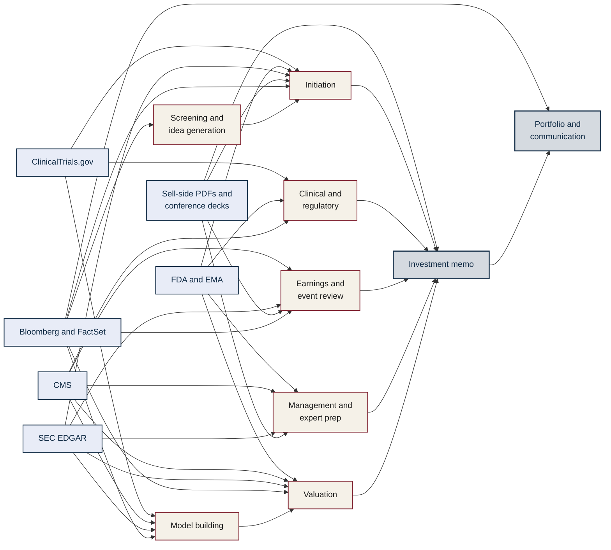

# Healthcare Equity Analyst Prompt Library

**Institutional-quality AI prompts for buy-side healthcare equity research.**

Version 1.4 · 113 prompts · 16 categories · 11 workflow chains · Four worked examples

---

## Overview

This library is a curated set of 113 prompts engineered for buy-side healthcare equity research workflows. It reflects institutional practice refined over 7+ years of senior buy-side healthcare research experience across dedicated healthcare-focused investment platforms. Coverage spans biotech, pharma, medtech, healthcare services and payors, tools and diagnostics, digital health, and international markets including European HTA, Japanese reimbursement, and Chinese biotech licensing dynamics.

The library is platform-agnostic. It works on Claude, ChatGPT, Gemini, and any frontier LLM with a sufficient context window. What distinguishes it from generic prompt collections is the governance layer — a set of standing instructions that establishes source hierarchy, required behaviours, and calibrated confidence scoring across every output — and the depth of each prompt, which typically prescribes seven to twelve analytical steps with embedded quantitative anchors rather than handing the structure to the model.

## How the library routes sources to workflows

The diagram below shows how primary data sources (left) feed into analytical workflows (middle) which feed into synthesis artefacts (right). This source-to-workflow routing is the backbone of the library's governance layer. Each prompt in the library specifies which sources to consult first; the diagram makes the pattern visible at a glance.

The library's standing instructions formalise this routing into a five-tier source hierarchy. Primary filings and company investor-relations materials sit at tier one. Regulatory records (ClinicalTrials.gov, FDA, EMA, CMS, PubMed) sit at tier two. Vendor data (Bloomberg, FactSet) sits at tier three. Sell-side research is used for triangulation only. Expert network transcripts are treated as single data points requiring cross-verification. Every prompt in the library honours this hierarchy.

## What's included

The library contains 113 prompts organised across 16 workflow categories covering initiation of coverage, earnings workflows, management meeting preparation, modelling and valuation, thesis development and pressure-testing, sell discipline and post-mortems, sell-side synthesis, expert network preparation, screening, thematic research, portfolio construction, ESG integration and stewardship, client communication and compliance, sub-sector deep dives across the six healthcare verticals, technical system integration for Bloomberg BQL and FactSet FQL and SEC EDGAR and ClinicalTrials.gov, and international coverage.

Supporting the prompts are eleven workflow chains that sequence prompts into end-to-end processes such as new coverage initiation, the quarterly earnings cycle, biotech catalyst workflows, annual review, and global name international exposure assessment. A coverage matrix at the start of the library shows at a glance how prompts distribute across workflow categories and sub-sectors. Every prompt carries a reasoning scaffold documenting its analytical movement (for example, "parse consensus → identify swing factors → pre-commit scenarios").

Four appendices round out the library. Appendix A is a tag index across the four-dimensional taxonomy. Appendix B documents the workflow chains. Appendix C documents source-data fidelity caveats for FDALabel, 13F filings, conference embargoes, CMS file timestamps, and other institutional data sources. Appendix D provides prompt engineering guidance covering temperature settings, reasoning style, context management, and platform-specific tuning.

A companion worked-examples document shows four prompts executed against illustrative scenarios, with mock source snippets preceding each rendered output.

## Quick start

Getting from repository clone to first useful output takes under five minutes. Begin by opening any frontier LLM and pasting the standing instructions from [`library/standing_instructions.md`](library/standing_instructions.md) at the start of your conversation, or using the compact variant for token-constrained sessions. The standing instructions establish the source hierarchy, required behaviours (separate facts from inference, time-stamp numbers, reconcile source conflicts, mark missing data, surface disconfirming evidence, apply MNPI guardrails, end with a confidence score between 0.00 and 1.00), and a default output skeleton for notes and memos.

Then select a prompt from [`library/healthcare_prompt_library_v1.4.md`](library/healthcare_prompt_library_v1.4.md) using the table of contents or the coverage matrix. Each prompt carries a YAML metadata header with its ID, tags, use-when cue, reasoning scaffold, expected inputs, and output format. Replace the bracketed placeholders such as `[TICKER]` or `[Phase 3 readout name]` with your specific case, paste into the LLM, and provide the listed inputs. Every output ends with a confidence score that should be used to calibrate how much weight to place on the analysis before acting.

## Platform-specific setup

### Claude (Anthropic)

For persistent use, create a [Claude Project](https://support.claude.com) and paste the full standing instructions into the project instructions field. Upload the library markdown file as a project knowledge document. Any conversation inside the project will inherit the instructions automatically, and Claude can reference specific prompts by ID (for example, "run EARN-04 on my SOLX Q3 update"). Claude's 200k-token context window comfortably handles the full library alongside source documents such as 10-Ks and transcripts, and the Artifacts feature is well-suited to producing structured outputs like IC memos, KPI trackers, and regime maps. For programmatic use, the Claude API accepts the standing instructions as a system prompt and prompts can be invoked by ID.

For one-off conversations, paste the compact standing instructions followed by the specific prompt. This minimises token overhead while preserving the governance discipline.

### ChatGPT (OpenAI)

For persistent use, create a [Custom GPT](https://help.openai.com/en/articles/8554407-gpts) named "Buy-Side Healthcare Analyst" and paste the full standing instructions into the instructions field. Upload the library markdown file as a knowledge document, and configure the GPT to use GPT-4o or GPT-5 as the underlying model for the strongest analytical performance. This turns the library into a named, reusable tool accessible from any ChatGPT conversation.

For one-off use, paste the compact standing instructions at the start of a conversation, then the specific prompt. The library works with both GPT-4 and GPT-5, though longer analytical chains and multi-document workflows benefit materially from the larger context window of newer models. The OpenAI Assistants API supports the same pattern programmatically.

### Gemini (Google)

For persistent use, create a [Gem](https://gemini.google.com/gems) with the full standing instructions as the persona and upload the library as context. Gemini's extended context window (up to 2M tokens in Gemini 1.5 Pro and beyond) comfortably fits the entire library plus substantial source documentation — a full 10-K, a quarter of earnings transcripts across the coverage universe, a set of FDA labels, and recent sell-side notes — in a single conversation. This makes Gemini particularly well-suited to multi-source triangulation workflows such as sell-side note synthesis and hospital operator cross-reads.

For one-off use, paste the compact standing instructions and the specific prompt. Gemini's integration with Google Workspace is useful when source documents are already in Google Drive or Sheets.

### Other platforms and programmatic use

The library is platform-agnostic and works with any frontier LLM supporting at least 32k tokens of context. For API-based workflows, the standing instructions can be passed as a system prompt and prompts invoked by ID. The YAML metadata headers in the markdown file are designed for programmatic ingestion into skill bases, knowledge management systems, or automated research pipelines. Outputs are structurally consistent across Claude, GPT-4/5, and Gemini when the standing instructions are applied.

## Recommended model settings

For analytical work — earnings analysis, valuation, thesis memos, post-mortems, compliance reviews — use temperature 0 to 0.2 for consistent, repeatable output. For ideation work — variant perception generation, thematic brainstorming, scenario construction — a modestly higher temperature of 0.3 to 0.5 can surface non-obvious framings. Temperatures above 0.7 should be avoided for this library; the prompts are structured and benefit from determinism rather than creativity. Appendix D in the main library file provides full prompt engineering guidance.

## Worked examples

The [`examples/`](examples/) folder contains four prompts executed against illustrative scenarios: a post-print thesis update for a mid-cap biotech after a margin-compression Q3 (EARN-04), a Phase 3 readout pre-mortem for an IBD asset with a tight effect-size bar (SUB-BIO-01), a 1-on-1 question stack for a structural heart medtech CFO meeting (MGMT-01), and an IC memo drafting a new 2% position in a liquid biopsy name (COMM-01). Each example includes mock source snippets showing the format of inputs supplied to the model, followed by the rendered output. Tickers are fictional; the analytical patterns and data types are drawn from real buy-side workflows.

## Library evolution

The library has moved through five versioned releases. Version 1.0 was the initial 56-prompt catalogue establishing institutional workflow coverage. Version 1.1 added the technical system integration category, compliance prompts, and sub-sector extensions, bringing the total to 100 prompts. Version 1.2 added the governance layer — standing instructions, source-data fidelity caveats, and YAML metadata headers — bringing the total to 102. Version 1.3 added post-mortem workflows, international coverage as a new category, scenario construction as a transferable discipline, people-dynamics prompts, healthcare-specific climate risk, and the worked examples companion document, bringing the library to 113 prompts. Version 1.4 added the coverage matrix, reasoning scaffolds on every prompt, enhanced worked examples with mock source snippets, prompt engineering guidance (Appendix D), and workflow-mapped source hierarchy in the standing instructions. See [`CHANGELOG.md`](CHANGELOG.md) for version-by-version detail.

## Author and attribution

Authored by a senior buy-side healthcare equity analyst with 7+ years of institutional research experience across dedicated healthcare-focused investment platforms. Maintained by [HHFinAi](https://github.com/HHFinAi).

Contributions, issues, and feature requests are welcome through the GitHub issues tab. Proposed new prompts should follow the existing schema (id, title, tags, use-when cue, reasoning scaffold, prompt text, expected inputs, expected output format).

## License

Released under the MIT License. See [`LICENSE`](LICENSE) for full terms. The library is free to use, modify, and redistribute with attribution.

## Disclaimer

This library is published for educational and professional reference purposes. It does not constitute investment advice or recommendation, and the author and maintainer accept no responsibility for investment outcomes derived from its use. Users are responsible for applying their own judgment, verifying primary sources, and complying with their firm's compliance and regulatory obligations, including material non-public information handling, disclosure requirements, and jurisdiction-specific rules on investment research and communication.

---

*Healthcare Equity Analyst Prompt Library v1.4 — 113 prompts across 16 categories with 11 workflow chains. Maintained at [github.com/HHFinAi](https://github.com/HHFinAi).*
