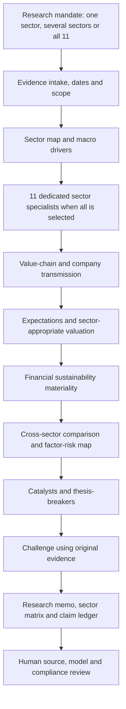

# Full Sector Research Agent

**All-sector investment research: evidence → industry economics → expectations → valuation → challenge → human judgment.**

**v3.0.0 · 11 major sectors · 79 research subsectors · 12 workflows · 77 offline tests**

An executable, evidence-led research agent for global equity sector research, cross-sector comparison, company underwriting and sustainability materiality. **Every major sector has a dedicated specialist and business-model-specific research lenses. Healthcare is one peer sector—not the default, and not a template imposed on other industries.**

Designed for institutional research workflows with traceable sources, explicit assumptions, reproducible calculations and reviewable outputs. This describes implemented controls, not independent audit certification, demonstrated investment performance or autonomous portfolio management.

## Start here

[Master research prompt](prompts/MASTER_AGENT.md) · [Sector coverage](docs/SECTOR_COVERAGE.md) · [Workflow architecture](docs/ARCHITECTURE.md) · [Input and valuation contracts](docs/INPUTS.md) · [Validation](docs/VALIDATION.md)

## Sector coverage

| Sector | Research subsectors | Specialist emphasis |
|---|---:|---|
| Energy | 7 | Commodity curves, asset costs, production decline, contracts, sustaining capital. |
| Materials | 9 | Capacity, grades, spreads, regional cost position and mid-cycle returns. |
| Industrials | 9 | Orders/backlog, installed-base services, utilization and cash conversion. |
| Consumer Discretionary | 7 | Income/credit, traffic, unit economics, cohorts, inventory and brands. |
| Consumer Staples | 5 | Price-volume-mix, elasticity, distribution and input-cost pass-through. |
| Health Care | 8 | Clinical/service utility, reimbursement, adoption, capital and cash flow. |
| Financials | 8 | Funding, credit losses, capital, reserves, fees and distributable equity value. |
| Information Technology | 7 | Adoption, monetization, bottlenecks, replacement cycles and dilution. |
| Communication Services | 6 | Subscribers, engagement, advertising, content cash and network capital. |
| Utilities | 5 | Regulated/merchant economics, rate base, recovery, financing and load. |
| Real Estate | 8 | Cash NOI, leases, cap rates, FFO/AFFO, property capital and refinancing. |

The sector scope follows the 11 major GICS sectors. The **79 research subsectors are original analytical groupings**, not the complete licensed GICS or SASB classification. Issuer classifications and segment exposures still require verification. The authoritative project catalog is [`sector_agent/sector_data.py`](sector_agent/sector_data.py); `python -m sector_agent catalog` prints it in a readable form. See the dated external framework references in [Sources](docs/SOURCES.md).

Each specialist carries its own mandate, subsector economic questions, KPIs, permitted valuation methods, transmission tests, primary-source requests, financial-materiality tests, analytical traps and diligence questions. Specialist prompts are assembled deterministically from that catalog and exported as standalone Markdown—not chosen from a generic healthcare template.

## How the agent works



The full cross-sector workflow executes **25 sequential stages**, including 11 actual specialist calls in live mode. Other workflows select a shorter sequence. A specialist receives its own companies and scoped evidence, plus explicitly marked global context; it does not see sibling specialists' first-pass judgments. The comparison stage receives the validated workpapers. These are analytical roles, not a claim of independent models or independent verification.

## Twelve workflows

| Workflow ID | Research task |
|---|---|
| `sector-deep-dive` | Full sector underwriting with sector-specific specialists. |
| `cross-sector-comparison` | Compare fundamentals, expectations and risks across selected sectors. |
| `macro-sector-transmission` | Translate rates, inflation, growth, FX and commodities into company economics. |
| `sector-rotation-review` | Review cycle and expectation evidence without inventing factor returns or betas. |
| `thematic-value-chain` | Trace themes across customers, suppliers and infrastructure without double-counting. |
| `sustainable-sector-review` | Separate financial materiality, sustainability outcomes and mandate eligibility. |
| `competitive-landscape` | Analyze industry structure, share, business quality and competitive economics. |
| `idea-screen` | Prioritize further diligence rather than force unsupported numerical rankings. |
| `company-initiation` | Connect company fundamentals to its sector and valuation method. |
| `earnings-readthrough` | Actuals, guidance, expectations and peer/company model implications. |
| `catalyst-review` | Event timing, conditional outcomes, financial impact and thesis-breakers. |
| `thesis-monitor` | One-shot review of a supplied thesis and new evidence; not a running scheduler. |

## Try the complete all-sector demo

Python **3.11+**, standard library only. Run from the repository checkout. Output directories must be new.

```bash
python -m sector_agent catalog
python -m unittest discover -s tests -v
python -m sector_agent run --brief examples/demo-all-sectors.json --out runs/all-sector-demo
python -m sector_agent verify --run runs/all-sector-demo
```

Open `runs/all-sector-demo/report.md`, `sector-matrix.csv` and `claim-ledger.csv`. The demo uses **fictional companies and synthetic inputs**. It is a deterministic software test, not live research or an LLM-generated investment conclusion.

## Use the prompts in a research host

```bash
python -m sector_agent plan --brief examples/brief-template.json --out runs/full-sector-plan
```

This exports 25 ordered, self-contained prompts for the all-sector workflow, including the 11 dedicated specialists. Edit the mandate and company universe first for real use. Supply primary sources through tools actually available to the host, apply the governing prompt and preserve evidence IDs between stages. Manual prompt use does not automatically enforce the Python validator; retain analyst review.

For a single sector use `"sector": "financials"` or another catalog ID. For selected sectors use `"sector": "multi"` and a `"sectors"` list. Every company in a multi-sector mandate must have an explicit sector and a valid research subsector. Example mandate templates include [AI value-chain research](examples/ai-value-chain-template.json) and [Financials/Real Estate transmission](examples/financials-real-estate-template.json).

## Live execution

Populate a brief with dated, appropriately redistributable sources and optional analyst valuation inputs. The blank template intentionally cannot run analysis until evidence is supplied.

```bash
export OPENAI_API_KEY="YOUR_LOCAL_KEY"
export OPENAI_MODEL="YOUR_AVAILABLE_MODEL_ID"
python -m sector_agent validate --brief data/my-brief.json
python -m sector_agent run --brief data/my-brief.json \
  --provider openai --allow-network --out runs/my-research \
  --max-calls 48 --max-input-chars 750000 --max-output-tokens 5000
```

The adapter sends the supplied packet to the fixed OpenAI Responses API endpoint with structured output and `store=false`. That setting is **not a zero-retention promise**. Verify provider policy, model compatibility and costs locally. HTTP-call, character and output-token limits are not a guaranteed dollar budget. No API key is committed or automatically loaded from `.env`.

**Source acquisition remains an explicit analyst or authorized-host step.** This repository does not package autonomous web crawling, market-data subscriptions, SEC/FDA/CMS connectors, trading or a background monitoring service. No live LLM call or paid-data retrieval was used to validate this release.

## Valuation and evidence controls

Nine implemented methods: **EV/EBITDA, DCF, simplified rNPV, P/E, P/TBV, DDM, property NAV, P/FFO and P/AFFO**. A business-model allow-list rejects obvious mismatches such as industrial EV/EBITDA for banks. Equity methods do not add/subtract cash and debt a second time. Inputs, normalized metrics, forecast quality and final suitability remain analyst responsibilities.

Source dates, IDs and scope are validated. An unscoped macro record does not fill all sectors' company-evidence requirements. A model must reference evidence scoped to its sector. Missing sector coverage or unresolved stage gaps prevents approval even if a later summary says everything is complete. No model means no manufactured numerical target.

Every run freezes its inputs, sector packs, prompts, stage workpapers and report, then records artifact hashes. Citation-ID checks do not establish semantic support; hashes are not digital signatures. Model confidence is a self-assessment, not a calibrated probability. Review explicitly:

```bash
python -m sector_agent verify --run runs/my-research
python -m sector_agent approve --run runs/my-research \
  --reviewer "HHFinAi" --note "Describe actual source and model checks" \
  --acknowledge-evidence
```

The review command is local self-attestation, not authenticated compliance authorization. Demo and blocked runs cannot be approved.

## Migration and ownership

The project replaces the healthcare-first v2 architecture on the same private repository. The repository URL/name is unchanged; history and the original MIT license are preserved. The original v1.4 library remains under [`reference/`](reference/); the v2 recovery branch is `archive/healthcare-first-agent-v2-2026-09-24`. See [Migration](docs/MIGRATION.md).

Created for **HHFinAi**. Analyst decision support only: no investment-performance promise, personalized trade execution, medical advice or automated regulatory certification.
